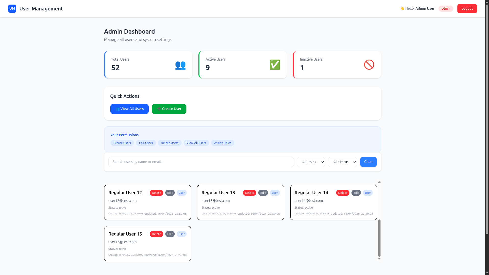
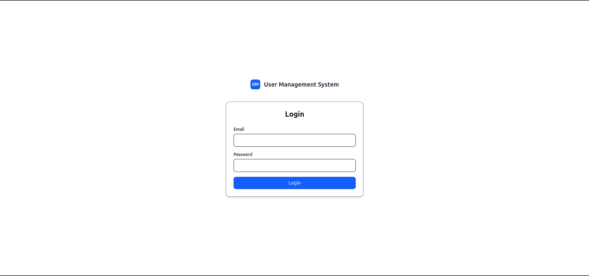

# 🚀 User Management Dashboard

Full-stack user management dashboard project built with React, Node.js, Express, and MongoDB with RBAC.

## Tech Stack

**Frontend:** React 18, Tailwind CSS, React Router, React Context  
**Backend:** Node.js, Express, MongoDB, Mongoose  
**Authentication:** JWT, bcrypt  
**Deployment:** Railway + MongoDB Atlas (Backend), Vercel (Frontend)

## Features

- 👥 Role-based dashboards (Admin/Manager/User)
- 📊 Real-time statistics (Total/Active/Inactive users)
- 🔍 Server-side search, filtering, and pagination
- ✨ Fully responsive design with mobile hamburger menu
- ✏️ Role-based CRUD operations with granular permissions
- 🔐 Secure JWT authentication with password hashing (bcrypt)
- 📱 Self-service profile editing for regular users
- 🔑 Auto-generated passwords (if skipped during creation)
- 🗃️ Seeded database with sample users for testing

## RBAC Logic

- Admin: full access
- Manager: manage users except delete and create
- User: only own profile access
- Protected using JWT middleware + role guard

## User Permissions

| Role    | Create | Read             | Update           | Delete |
| ------- | ------ | ---------------- | ---------------- | ------ |
| Admin   | ✅     | ✅               | ✅               | ✅     |
| Manager | ❌     | ✅               | ✅               | ❌     |
| User    | ❌     | ✅ (own profile) | ✅ (own profile) | ❌     |

## Project Structure

```bash
backend/
  src/
   config/
   controllers/
   middlewares/
   models/
   routes/
   services/
   utils/
   validators/


frontend/
  src/
    components/
    config/
    context/
    hooks/
    pages/
    utils/

```

## API Endpoints

### Auth

| Method | Endpoint          | Description | Auth |
| ------ | ----------------- | ----------- | ---- |
| POST   | `/api/auth/login` | login user  | ❌   |

### Admin

| Method | Endpoint         | Description | Auth |
| ------ | ---------------- | ----------- | ---- |
| POST   | `/api/users/`    | Create user | ✅   |
| DELETE | `/api/users/:id` | Delete user | ✅   |

### Users

| Method | Endpoint              | Description         | Auth |
| ------ | --------------------- | ------------------- | ---- |
| GET    | `/api/users/profile`  | Get user profile    | ✅   |
| PUT    | `/api/users/profile/` | Update user profile | ✅   |

### Admin and Manager

| Method | Endpoint         | Description     | Auth |
| ------ | ---------------- | --------------- | ---- |
| GET    | `/api/users/`    | Get all users   | ✅   |
| GET    | `/api/users/:id` | Get single user | ✅   |
| PUT    | `/api/users/:id` | Update users    | ✅   |


## Screenshots Overview

## Login Page



## Dashboard Page




## Prerequisites

- Node.js 18+
- MongoDB Atlas account (free tier)

## Installation

```bash
git clone https://github.com/Abhrajit-debnath/User-Management-System
cd user-management

### Backend
cd backend
npm install
npm run dev

### Frontend
cd frontend
npm install
npm run dev
```

## Environment Variables

```bash
MONGO_URI=your_mongodb_connection_string
JWT_SECRET=your-very-long-random-secret-key-minimum-32-chars
PORT=8000
```
